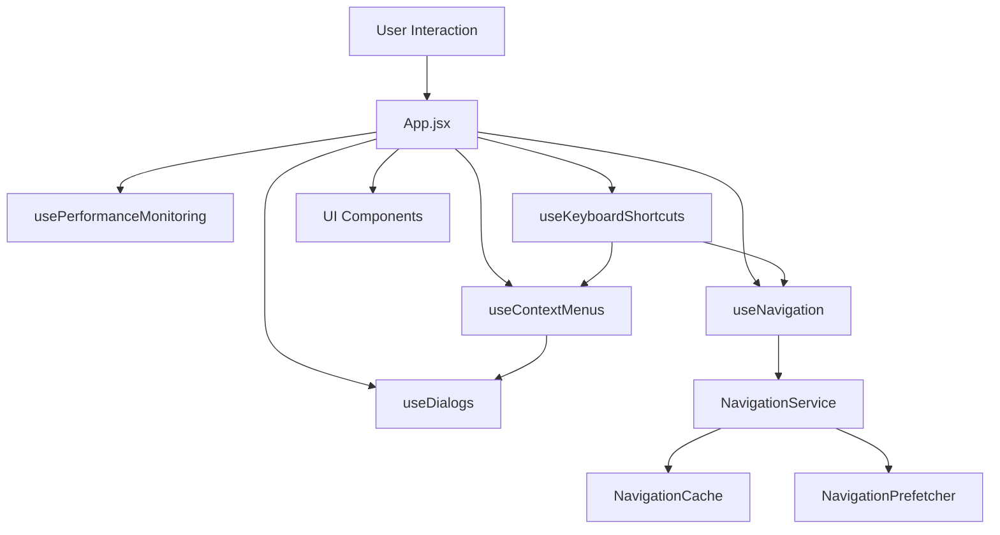
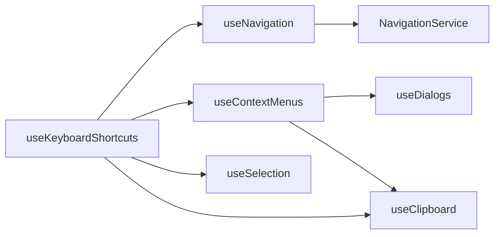

# File Explorer Architecture

This document outlines the modular architecture of the Blueprint File Explorer after refactoring from a monolithic `App.jsx`.

## 📁 Project Structure

```
frontend/src/
├── app.jsx                    # Main App component (simplified)
├── services/
│   └── NavigationService.js   # Navigation cache and prefetching
├── hooks/
│   ├── index.js              # Hooks barrel export
│   ├── useNavigation.js      # Navigation logic and state
│   ├── useDialogs.js         # Dialog state management
│   ├── useContextMenus.js    # Context menu logic
│   ├── usePerformanceMonitoring.js # Performance tracking
│   ├── useKeyboardShortcuts.js     # Keyboard event handling
│   ├── useFileOperations.js  # File operations (existing)
│   ├── useSelection.js       # File selection (existing)
│   └── useClipboard.js       # Clipboard operations (existing)
├── components/               # UI components
└── utils/                   # Utility functions
```

## 🧩 Architecture Components

### Services Layer

#### `NavigationService.js`
- **NavigationCache**: LRU cache with TTL for instant navigation
- **NavigationPrefetcher**: Smart prefetching of likely navigation targets
- Singleton instances exported for global use

### Hooks Layer

#### `useNavigation.js`
**Responsibility**: All navigation-related logic
- Ultra-fast navigation with caching and prefetching
- Loading state management with smart delays
- Parent/child directory navigation
- Cache management and clearing

#### `useDialogs.js`
**Responsibility**: Dialog state and operations
- Dialog state management (open/close/type)
- Confirmation, prompt, and alert dialogs
- Callback handling for user actions

#### `useContextMenus.js`
**Responsibility**: Context menu logic
- File context menu state and positioning
- Empty space context menu state
- Context menu action handlers (copy, cut, rename, delete, hide)
- PowerShell integration

#### `usePerformanceMonitoring.js`
**Responsibility**: Performance tracking and stats
- Navigation performance metrics
- Cache hit rate monitoring
- Frontend/backend stats collection

#### `useKeyboardShortcuts.js`
**Responsibility**: Keyboard event handling
- All keyboard shortcuts (F5, Ctrl+C, arrows, etc.)
- Throttled event handling for performance
- Integration with other hook actions

### Main App Component

The refactored `App.jsx` is now focused on:
- UI rendering and layout
- Hook integration and coordination
- High-level application flow
- Component composition

## 🔄 Data Flow



## 📊 Benefits of Refactoring

### 🎯 Separation of Concerns
- Each hook has a single, well-defined responsibility
- Easier to understand and maintain individual features
- Reduced cognitive load when working on specific functionality

### 🔧 Improved Testability
- Individual hooks can be tested in isolation
- Mock dependencies more easily
- Better unit test coverage

### 🚀 Enhanced Reusability
- Hooks can be reused across different components
- Navigation logic can be used in other parts of the app
- Services can be imported independently

### 📈 Better Performance
- Optimized imports (barrel exports)
- Cleaner dependency tracking
- More efficient re-renders

### 🛠️ Easier Development
- Smaller files are easier to navigate
- Clear boundaries between features
- Simplified debugging and development

## 🔗 Hook Dependencies



## 🎨 8-bit Retro Style Guidelines

All components maintain the established 8-bit retro aesthetic:
- Bold, blocky visuals consistent with classic 8-bit design
- Clean and uncluttered layouts
- Zen minimalist approach
- No bright neon "hacker" green (#00ff00)
- Alternative retro color palette

## 🎭 UI State Management

### File Selection and Hover States
**Fixed Issue**: Selection state now properly takes precedence over hover state
- **Problem**: Hover colors were overriding selection colors in both file items and sidebar
- **Solution**: Updated CSS specificity using `:not(.selected)` and `:not(.active)` selectors
- **Result**: Selected file items and active sidebar items maintain their blue selection styling even when hovered
- **Enhancement**: Selected/active hover states provide subtle additional feedback without losing selection visual cues

**CSS Implementation**:
```css
/* Hover only applies to non-selected file items */
.file-item:hover:not(.selected) {
  background: var(--blueprint-surface-hover);
  border-color: var(--blueprint-border);
  transform: translateY(-1px);
}

/* Selected file state always visible */
.file-item.selected {
  background: var(--blueprint-primary);
  color: white;
  border-color: var(--blueprint-primary);
}

/* Enhanced feedback for selected file items on hover */
.file-item.selected:hover {
  background: var(--blueprint-primary);
  color: white;
  box-shadow: 0 2px 8px rgba(59, 130, 246, 0.3);
  transform: translateY(-2px);
}

/* Hover only applies to non-active sidebar items */
.sidebar-item:hover:not(.active) {
  background: var(--blueprint-surface-hover);
  color: var(--blueprint-text);
  transform: translateX(2px);
}

/* Active sidebar state always visible */
.sidebar-item.active {
  background: var(--blueprint-primary);
  color: white;
}

/* Enhanced feedback for active sidebar items on hover */
.sidebar-item.active:hover {
  background: var(--blueprint-primary);
  color: white;
  box-shadow: 0 2px 6px rgba(59, 130, 246, 0.3);
  transform: translateX(1px);
}
```

## 🚦 Usage Examples

### Navigation
```javascript
const { navigateToPath, currentPath, directoryContents } = useNavigation(setError, setStats);
await navigateToPath('/some/path', 'user');
```

### Dialogs
```javascript
const { showDialog } = useDialogs();
showDialog('confirm', 'Delete File', 'Are you sure?', '', onConfirm);
```

### Context Menus
```javascript
const { handleContextMenu, contextMenu } = useContextMenus(/* deps */);
// handleContextMenu will be called from file items
```

This architecture promotes maintainability, testability, and future extensibility while preserving all the performance optimizations and features of the original implementation. 